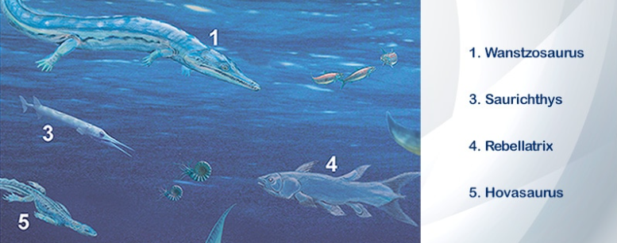

<h1 align="center">Los Dinosaurios</h1>

> Fuente extraída desde este [enlace](https://www.mundoprimaria.com/dinosaurios)

## Toda la información sobre los dinosaurios

Los dinosaurios existieron hace mucho tiempo y ya no están entre nosotros. Y sin embargo, ¡los amamos! Por eso hemos creado este artículo para proveerte de información completa sobre los dinosaurios, para que puedas saber más sobre los dinosaurios, para que puedas saber más sobre ellos y entender un poco más sobre cómo vivían.

| Imagen                         | Titulo                                           |
| ------------------------------ | ------------------------------------------------ |
|  | [**`Tipos y nombres de especies`**](./nombres)   |
|  | [**`Eras Geológicas`**](./eras)                  |
|  | [**`Clasificación de los dinosaurios`**](./eras) |

El cine ha despertado profundamente nuestra imaginación, haciendo que imaginemos que los tenemos cerca. ¿Acaso no estaría genial ver a un _Tyrannosaurus rex_ en persona? ¿Quién no querría acariciar a un pacífico _Brontosaurus_?

Lo cierto es que solo tenemos idea de su existencia gracias a los restos fósiles y al trabajo de los científicos especializados en analizarlos. Se trata de los paleontólogos, quienes nos han traído todo lo que se sabe sobre los dinosaurios y que cada día trabajan para darnos a conocer más.

¡Acompáñanos! ¡Toda la información sobre los dinosaurios está aquí!

## Dinosauria: la era de los dinosaurios

La gran era de los dinosaurios se dio durante el período Mesozoico, que fue el tiempo en el que vivieron los animales más icónicos que aún nos quitan el sueño. Empezó hace 252 (M.a.) y duró unos 186 M.a.

Sucedió después de un evento de extinción masiva en el que desaparecieron el 95% de las especies marinas. También provocó la muerte del 70% de los animales que vivían en tierra. Esto dio lugar para el nacimiento de nuevas especies.

Todo sucedió en los períodos que comprenden el Mesozoico. Estamos hablando del **Triásico, Jurásico y Cretácico**.

### Triásico (hace 252 a 201 M.a.)

En los inicios de Triásico todo estaba reunido en un enorme continente que se conoce como Pangea. Cuando se avanzaba más adentro de este enorme bloque el clima era más cálido y seco, debido a que no abundaban las costas.

Los millones de años siguientes hubo movimientos tectónicos que comenzaron a provocar la división y separación de la Pangea. Parte de este proceso involucró el brote de lava entre huecos y fisuras. Como consecuencia brotó el el dióxido de carbono, un gas de efecto invernadero que calentó el clima y comenzó a provocar altibajos climáticos extremos.

Sus primeros 20 millones de años fueron _violentamente variables_, con temperaturas que variaban entre los 50 y los 60 grados Celsius. Esto fue acompañado por períodos lluviosos que les dieron algunas ventajas a los animales en algunas regiones.

Florecieron plantas durante todo el Triásico mayormente coníferas y helechos. Esto facilitó el ascenso de los reptiles, como variantes de lagartos y tortugas, cocodrilos y pro supuesto de los dinosaurios.

Los primeros aparecieron durante la más alta actividad volcánica. Se diversificaron en saurópodos, y terópodios, en ambos casos herbívoros, junto a ornitisquios y también herbívoros con pico.

No obstante aún no tenían un tamaño demasiado desarrollado. De hecho eran diminutos como perros pequeños. Y a pesar de que los territorios estaban conectados no se propagaron demasiado.

Esto se debió a que las áreas ecuatoriales eran demasiado calurosas y secas con lluvias torrenciales que provocaban inundaciones mortales. Incluso hubo incendios forestales que despoblaron grandes zonas arboladas.

En estas áreas sólo pudieron sobrevivir los dinosaurios carnívoros, que obviamente no dependían de las plantas para sobrevivir.

Hubo otro evento de extinción masiva cuyas causas y duración son un verdadero misterio. Una vez más esto dejó importantes agujeros ecológicos por llenar.

### Jurásico (hace 201 a 145 millones de años)
