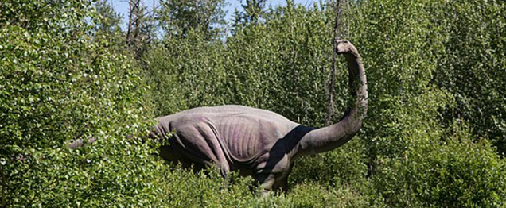
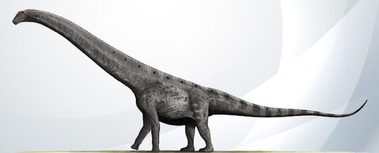
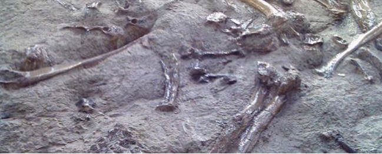
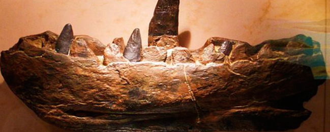

<h1 align="center">Los Dinosaurios</h1>

> Fuente extraída desde este [enlace](https://www.mundoprimaria.com/dinosaurios)

## Toda la información sobre los dinosaurios

Los dinosaurios existieron hace mucho tiempo y ya no están entre nosotros. Y sin embargo, ¡los amamos! Por eso hemos creado este artículo para proveerte de información completa sobre los dinosaurios, para que puedas saber más sobre los dinosaurios, para que puedas saber más sobre ellos y entender un poco más sobre cómo vivían.

| Imagen                         | Titulo                                           |
| ------------------------------ | ------------------------------------------------ |
|  | [**`Tipos y nombres de especies`**](./nombres)   |
|  | [**`Eras Geológicas`**](./eras)                  |
|  | [**`Clasificación de los dinosaurios`**](./eras) |

El cine ha despertado profundamente nuestra imaginación, haciendo que imaginemos que los tenemos cerca. ¿Acaso no estaría genial ver a un _Tyrannosaurus rex_ en persona? ¿Quién no querría acariciar a un pacífico _Brontosaurus_?

Lo cierto es que solo tenemos idea de su existencia gracias a los restos fósiles y al trabajo de los científicos especializados en analizarlos. Se trata de los paleontólogos, quienes nos han traído todo lo que se sabe sobre los dinosaurios y que cada día trabajan para darnos a conocer más.

¡Acompáñanos! ¡Toda la información sobre los dinosaurios está aquí!

## Dinosauria: la era de los dinosaurios

La gran era de los dinosaurios se dio durante el período Mesozoico, que fue el tiempo en el que vivieron los animales más icónicos que aún nos quitan el sueño. Empezó hace 252 (M.a.) y duró unos 186 M.a.

Sucedió después de un evento de extinción masiva en el que desaparecieron el 95% de las especies marinas. También provocó la muerte del 70% de los animales que vivían en tierra. Esto dio lugar para el nacimiento de nuevas especies.

Todo sucedió en los períodos que comprenden el Mesozoico. Estamos hablando del **Triásico, Jurásico y Cretácico**.

### Triásico (hace 252 a 201 M.a.)

En los inicios de Triásico todo estaba reunido en un enorme continente que se conoce como Pangea. Cuando se avanzaba más adentro de este enorme bloque el clima era más cálido y seco, debido a que no abundaban las costas.

Los millones de años siguientes hubo movimientos tectónicos que comenzaron a provocar la división y separación de la Pangea. Parte de este proceso involucró el brote de lava entre huecos y fisuras. Como consecuencia brotó el el dióxido de carbono, un gas de efecto invernadero que calentó el clima y comenzó a provocar altibajos climáticos extremos.

Sus primeros 20 millones de años fueron _violentamente variables_, con temperaturas que variaban entre los 50 y los 60 grados Celsius. Esto fue acompañado por períodos lluviosos que les dieron algunas ventajas a los animales en algunas regiones.

Florecieron plantas durante todo el Triásico mayormente coníferas y helechos. Esto facilitó el ascenso de los reptiles, como variantes de lagartos y tortugas, cocodrilos y pro supuesto de los dinosaurios.

Los primeros aparecieron durante la más alta actividad volcánica. Se diversificaron en saurópodos, y terópodios, en ambos casos herbívoros, junto a ornitisquios y también herbívoros con pico.

No obstante aún no tenían un tamaño demasiado desarrollado. De hecho eran diminutos como perros pequeños. Y a pesar de que los territorios estaban conectados no se propagaron demasiado.

Esto se debió a que las áreas ecuatoriales eran demasiado calurosas y secas con lluvias torrenciales que provocaban inundaciones mortales. Incluso hubo incendios forestales que despoblaron grandes zonas arboladas.

En estas áreas sólo pudieron sobrevivir los dinosaurios carnívoros, que obviamente no dependían de las plantas para sobrevivir.

Hubo otro evento de extinción masiva cuyas causas y duración son un verdadero misterio. Una vez más esto dejó importantes agujeros ecológicos por llenar.

### Jurásico (hace 201 a 145 M.a.)

Los dinosaurios que sobrevivieron tenían dos características adaptativas muy interesantes. Por un lado tenían la capacidad de mantenerse erguidos. Por el otro poseían pulmones que trabajan con gran eficiencia y que los fortalecieron.

Estos rasgos los ayudaron a evolucionar hasta convertirse en bestias gigantescas durante el Período Jurásico.

La división de Pangea comenzó prosperar. Una fisura se convirtió en el Océano Atlántico. También aparecieron los continentes América del Sur, América del Norte e India.

Fue la era del dominio de los pliosaurios en los mares. Eran dinosaurios que tenían unos 15 metros de largo y que eran cazadores realmente impresionantes. En tierra abundaban los insectos como los escarabajos y las libélulas.

También surgieron los mamíferos, pero ninguno más grande que una ardilla. No tendrían aún lugar para su pleno desarrollo. Plantas como las cícadas que eran palmeras que producían conos con semillas se volvieron muy abundantes.

Los dinosaurios herbívoros comenzaron a desarrollar cuellos largos para alcanzar las hojas superiores de las coníferas. Esto fue acompañado por la aparición de un sistema digestivo más grande y adecuado para asimilar esta clase vegetal duro.

De este modo hubo una mayor diversidad, abundancia y tamaño en los saurópodos en el Jurásico Superior. Pero la reducción de coníferas al final de este tiempo también afecto a la proporción de dinosaurios herbívoros de cuello largo

### Cretácico (hace 145 a 66 M.a.)

A esta altura la Pangea había alcanzado un alto grado de fragmentación con la separación completa de islas y continentes. Surgió un océano de poca profundidad que se llamó Vía Marítima Interior Occidental. Inundó gran parte de lo que hoy es Estados Unidos y Canadá.

Comenzaron a circular las corrientes oceánicas y el Incremento del CO2 hizo que el clima de todo el plante se volviera templado. Los polos existían pero eran cálidos, con grandes bosques en desarrollo.

En este período aparecieron las plantas cuyas floraciones dieron origen a insectos como las hormigas, las mariposas y los saltamontes.

También hubo situaciones problemáticas como el Evento Anóxico Oceánico, que fue la primera vez en el Cretácico en que los mares se volvieron anóxicos. Es decir que se quedaron con bajos niveles de oxígeno.

Las causantes fueron las erupciones volcánicas masivas que tuvieron gran repercusión en los ecosistemas marinos.

Al final de este tramo las grandes masas terrestres ya estaban asentadas y habían ganado el formato territorial que conocemos en la actualidad. Diferentes clases de dinosaurios habitaban en cada sector.

En 2005 paleontólogos de Alemania descubrieron una versión reducida de un dinosaurio más grande. Dedujeron que evolucionó en una isla, lo que explicaría su tamaño. Era un territorio que no tenía suficiente comida ni espacio para promover un mayor desarrollo.

En la última etapa del Mesozoico, 66 millones de años atrás hubo un evento cataclísmico. Un meteorito colisionó contra el planeta y alteró el clima por completo de la noche a la mañana. Así se extinguieron los dinosaurios y la mitad de la vegetación que había existido hasta entonces. Esto le dio lugar a la siguiente especie para reinar. Así fue como nació la era de los mamíferos.

### ¿Qué son los dinosaurios?

Aunque parezca un asunto obvio, hay características que definen lo que es un dinosaurio. Los que es un dinosaurio. Los que establecieron estas particularidades fueron los científicos especializados en delimitar el objeto de estudio, con el fin de realizar una tarea una tarea concreta y distinguible.

Por eso lo que se entienden como dinosaurios son los animales prehistórico que reúnen estos requisitos.

1. **Eran reptiles que vivieron en la era Mesozoica**. Es decir hace 245 a 66 millones de años. Hay que destacar que ellos no estaban solos, ya que habitaban en diversas comunidades ecológicas. Por lo que en ese tiempo también había insectos, anfibios e incluso mamíferos.

2. **vivían en la tierra.** No se incluyen a los que habitaban en el agua como el mosasaurios y plesiosaurios. Había reptiles nadadores pero no eran dinosaurios. Esto también excluye a los que podían volar como pterosaurio.

3. **Tenían vértebras**. Sin importar su tamaño los dinosaurios poseían una columna vertebral bien definida.

4. **Caminaban con sus patas directamente debajo como lo hace los pájaros**. Gracias a esto eran grandes caminantes y corredores, y fue una de las claves de su larga supervivencia.

5. **Eran diápsidos**. Es decir, que tenían dos orificios detrás de los ojos. Esto aligeraba sus cráneos y les daba unión a sus músculos faciales.

## Extinción de los dinosaurios

Anteriormente nombramos la causa más popular y probable de la extinción de los dinosaurios. Estamos hablando de la caída de un asteroide que se habría estrellado contra lo que es hoy la Península de Yucatán hace 66 millones de años.

Esto habría diseminado en la atmósfera una gran cantidad material terrestre y partes del asteroide bloquean la luz solar. Como es de imaginarse aparejado el fin de los dinosaurios.

## Plumas en los dinosaurios

Los dinosaurios tenían plumas, y algunos expertos aseguran que eran más comunes de los que imaginamos, que podrían haberlas tenido especímenes en las que no se les ha representado. El Dromeosaurio las poseía de acuerdo a sus fósiles.

Estas primeras plumas no tenían la finalidad de hacer que volaran. En realidad aparecieron para ayudarlos a regular la temperatura, proveer camuflaje y equilibrio cuando cuando se desplazaban corriendo.

## El dinosaurios más grande

Siendo criaturas gigantes en comparación con nosotros, es lógico preguntarse cuál era el más grande de todos. Uno de los que podría tener el primer puesto es el _Argentinosaurus_ que se descubrió en 1987 en Argentina. Tenía unos 40 metros de altura y su peso rondaba en las 100 toneladas.

## ¿De dónde proviene el término dinosaurio?

El nombre dinosaurio (del clado dinosaurio) fue asignado en 1842 por el anatomista inglés Richard Owen. Fue el que hizo la primera descripción formal de sus descubrimiento conocidos como Claideidon y Cetiosaurus.

Propuso este término para cubrir la necesidad de designar a los gigantes extintos conocidos como _Megalosaurus_, _Hyalaeosaurus_ e _Iguanodón_, cuyos restos fosilizados se habían encontrado en Inglaterra.

Proviene del griego _deinos_ que significa _terriblemente grande_ _sauros_ que quiere decir _reptil_ o _lagarto_. De ahí la palabra dinosaurio.

Así se comenzaron a llamar a los reptiles gigantes terrestres con cinco vértebras en sus caderas,lo que los diferenciaba de otros reptiles que tenían solamente dos. Además mantenían sus extremidades bajo el cuerpo.

El clado dinosauria hoy está conformado por 800 nombres estándares y unas 1000 especies. Y lado investigaciones continuad siguen sumando más nombres y teorías sobre cómo vivieron y qué características tenían.

## Estudio de sus fósiles

Todo lo que sabemos sobre los dinosaurios es a través de sus restos fósiles. Estos son hallazgos de huesos o de materia biológica que bajo condiciones especiales llamadas fosilización han persistido hasta nuestros días.

Hay un registro fósil extenso que da cuenta de la diversidad, de la forma de vida y de las adaptaciones que tuvieron que tener para sobrevivir. Generalmente se encuentran atascados en rocas sedimentarias.

Además se pueden encontrar con la abundancia suficiente para saber que eran los seres dominantes durante el Mesozoico. Y aun así lo que hoy hemos encontrado en sólo una pequeña parte de la gran variedad que debió haber existido entonces...

## La visión de los dinosaurios en otros tiempos

Richard Owen fue el primero que hizo la descripción formal de un dinosaurio dándoles nombres y características definidas. Pero no era la primera vez que se daba con sus huesos enormes. Sólo que no había habido hasta entonces una forma de entender lo que eran.

Ahora se concluye que las leyendas grecorromanas sobre grifos en el siglo VII (a.c.) se inspiraron en el hallazgo de proteceratópsicos en Altai, Mongolia. En 1676 Robert Plot en la Universidad de Oxford incluyó en un ensayo de historia natural el dibujo de lo que parecía el fémur de un dinosaurio. Erróneamente pensó que era de un elefante de la era romana.

En Nueva Jersey en el siglo XVIII se hallaron restos fósiles y fueron discutidos en la Sociedad Filosófica de Estados Unidos en Filadelfia. E incluso Lewis y Clarke dieron con huesos de dinosaurios en el oeste de este país.

Además Solomon Ellsworth Jr, encontró en 1818 fósiles, cuando excavaba en si granja en Windsor en Connecticut. Hay registros confiables de esto en el _American Journal of Science and Arts_ de 1820.

Ese mismo año en el sur de Inglaterra el clérigo William Buckland describió la mandíbula dentada del Megalusaurio. A esto se suma el médico Gideon Mantel quien hizo lo mismo con respeto a un Iguanodonte.

En 1934 fue encontrado el Iguanodonte de Maidstone. Era un esqueleto parcial hallado en Brighton, en el bosque de Tillgate.

## ¿En qué año existieron los dinosaurios?

Tal como antes expresamos, los dinosaurios vivieron durante la mayor parte de la era Mesozoica.Esto constituyó un período que va desde los 252 millones de años a los 66 millones de años. Proviene de pequeños ancestros o dinosauriomorfos del Triásico que lograron prosperar en un clima duro y seco.

No dominaron de inmediato. Primero tuvieron una dura competencia de los arcosaurios que antecedieron a los cocodrilos, y que fueron los gobernantes durante decenas de millones de años.

La tierra comenzó a cambiar profundamente con erupciones volcánicas que entraron en erupción provocando el calentamiento global y un evento de extinción masiva. Esto permitió que los dinosaurios tuvieran el campo libre para crecer y convertirse en lo amos durante el período Jurásico.

Un ejemplo de esto es el Vouivria damparisensis que era un titanosaurio antiguo, que se
