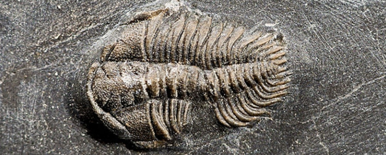
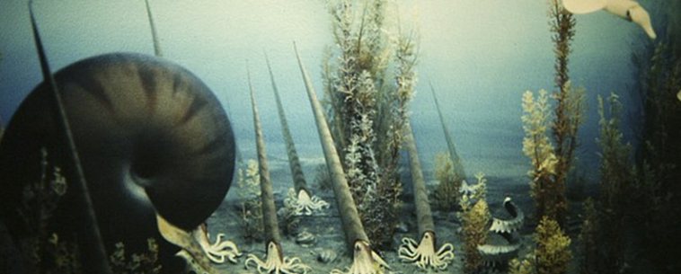
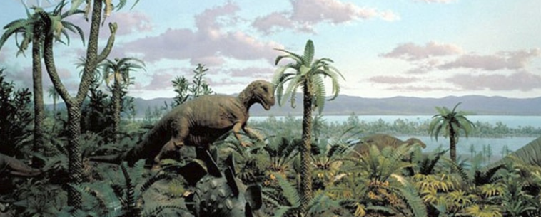
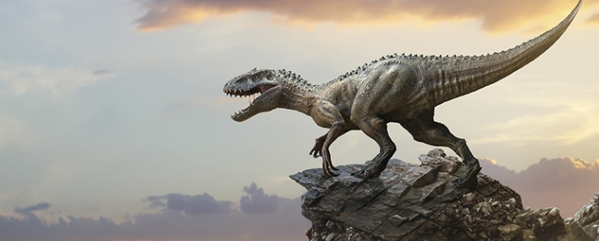
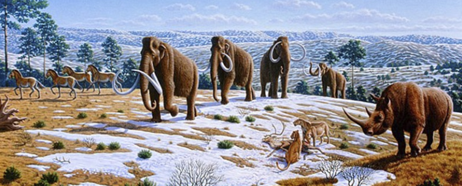

<h1 align="center">Eras geológicas</h1>

> Fuente extraída desde este [enlace](https://www.mundoprimaria.com/dinosaurios/eras-geologicas)

La escala de tiempo geológico es uno de los mayores logros de la geología en particulor. Es una sistema de referencia y comunicación para comparar rocas y fósiles que se emplea en todo el mundo.

Es el equivalente geológico de la tabla eródica de los elementos. Por ejemplo un paleontólogo puede llamar a un colega y decirle: "Acabo de encontrar un nuevo trilobite incríble del Devónico de Nueva York". Sucolega comprederá a qué momento geológico pertenece ese resto fósil.

La mayoría de los límites en la escala de tiempo geológico tiene que ver con el origen o extinción de determinados tipos de fósiles. Saber cuándo aparecieron o cuando se extinguieron es útil para determinar las edades de las rocas en el camo.

## Las eras geologicas y sus periodos

| Era Paleozoica      | Era Mesozoica     | Era Cenozoica       |
| ------------------- | ----------------- | ------------------- |
| Periodo Cámbrico    | Periodo Triásico  | Periodo Paleógeno   |
| Periodo Ordovícico  | Periodo Jurásico  | Periodo Neógeno     |
| Periodo silúrico    | Periodo Cretácico | Periodo Cuaternario |
| Periodo Devónico    |                   |                     |
| Periodo Carbonífero |                   |                     |
| Periodo Pérmico     |                   |                     |

## La escala de tiempo geológico

El estudio de la geología, paleontología y biología se lleva a cabo a través de la escala de tiempo geológico. Esta se divide en eones,eras, períodos y épocas.

### Eones

El eón es la categoría más amplia de tiemo geológico. Toda la historia de la Tierra se ha egistrado en cuatro eones. Si se ordenan desde el másantiguo al más joven son el **Hadeón, Arcaico, Proterozoico, y el Fanerozoico**.

El algunas ocasiones se nombra al Hadeano, el arcaino y el proterozoico como **Precámbrico**, con fines informales. Esto tiene que ver con que el período Cámbrico define el comienzo del eón Fanerozoico. Entonces se dice que todas las rocas del Cábrico tienen una edad precámbrica.

**Actualmente vivimos en el eón Fanerozoico que significa _vida visible_**. Se caraceriza por abundantes y complejos restos fosilizados. Cómo es el éon más joven está muy bien representado or la roca en la superficie de nuestros mundo.

DEbido a esto la mayoríade los paleontólogos y geológos estudian fósile y rocas del eón **Fanerozoico**.

### Eras

### Períodos

### Épocas y edades

## Era Paleozoica

### Período Cámbrico

### Período Ordovícico

### Período Silúrico

### Período Devónico

### Período Carbonífero

### Período Pérmico

## Era Mesozoica

### Período Triásico

### Período Jurásico

### Período Cretácico

## Era Cenozoica

### Período Paleógeno

### Período Neógeno

### Período Cuaternario
