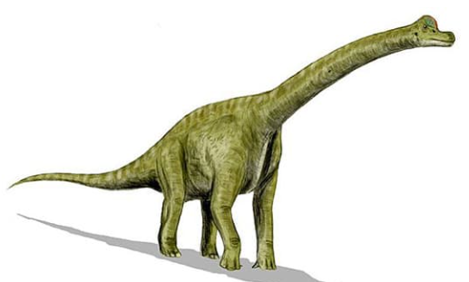
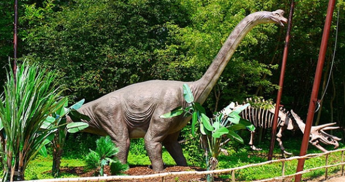
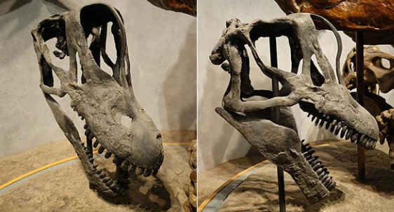
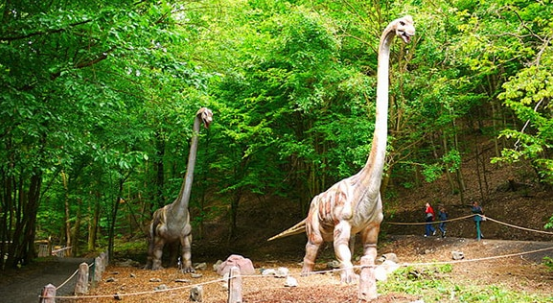
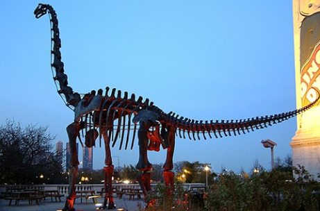

<h1 align="center">Brachiosaurus</h1>

> fuente extraída desde este [enlace](https://www.mundoprimaria.com/dinosaurios/tipos-de-dinosaurios-y-nombres-especies/brachiosaurus)

## ¿Qué es un Brachiosaurus?

Se trata de uno de los dinosaurios más grandes que alguna vez haya existido en nuestro planeta. Es uno de los especímenes que más se conoce de la prehistoria. Y también es uno de los que más aparece en la cultura popular.

Los restos fósiles de Brachiosaurus causaron comfución repetidamente en el pasado. Los únicos hallazgos repetidaamente en el pasado. Los únios hallazgos debimante asignados fueron los ubicados en America del Norte. Sus huesosfueron situados por primera vez en el género Ultrasaurus.

Sin embargo más tarde se descubrió que eran fósiles mixtos de Brachiosarus y Supersaurus. También se han hallado restos en Argelia y Portugal, aunque estos no han sido confirmados y se cree que pertenecen a un género diferente en el grupo Brachiosauridae. El hallazgos portugués ahoa ha sido asignado al género Lusotian

Hubo ora confusión con el conocido Brachiosaurus brancai, que se encuentranen el Museo de Historia Natural de Berlín. Figura en el Libro Guiness de los Récords mundiales or ser el dinosaurio montando más grande.

En 2009, se descubrióque tampocose trataba de un Brachiosaurus, sino que era unpariente cercano el Giraffatitan brancai.

Brachiosaurus significa _lagarto armado_ y se compone de ls términos en latín _bracchium_ que quiere brazo y _saurus_ que es lagarto.El género de los dinosaurios se llamó así porque tiene patasdelanteras inusualmente largas en comparacionescon sus congéneres de cuello largo.

La única especie reconocida hoy es el _Brachiosarus altithorax_. Su nombre se traduce como _pecho_ alto.

## Comparación con el Giraffatitan

El conocido cmo Giraffatitan también pertenece a la familia de los Brachiosauridae.Consiste en un pariente cercano de Brachiosaurus y es con el cual se confundieron sus fósiles durante mucho tiempo.

Se suponía que pertenecían al mismo género. Peroun esdio demostró que existen diferencian claras entre las dos especies.

Giraffatitan es similar en tamaño, poseía patas delanteras largasy fosas nasales altas. No obstante tiene una grupa más corta y una cola más delgada y corta que el Brachiosaurus. Aunque no es tan popular como este.

| `Brachiosaurus` pesaba entre 23 a 24 toneladas |
| ---------------------------------------------- |
|                |

| Reconstrucción del cráneo de `Brachiosaurus` |
| -------------------------------------------- |
|              |

| Reconstrucción del `Brachiosaurus` |
| ---------------------------------- |
|    |

| Reconstrucción del esqueleto del `Brachiosaurus` |
| ------------------------------------------------ |
|                  |
