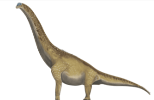

<h1 align="center">Brachiosaurus</h1>

> fuente extraída desde este [enlace](https://www.mundoprimaria.com/dinosaurios/tipos-de-dinosaurios-y-nombres-especies/brachiosaurus)

## ¿Qué es un Brachiosaurus?

Se trata de uno de los dinosaurios más grandes que alguna vez haya existido en nuestro planeta. Es uno de los especímenes que más se conoce de la prehistoria. Y también es uno de los que más aparece en la cultura popular.

Los restos fósiles de Brachiosaurus causaron comfución repetidamente en el pasado. Los únicos hallazgos repetidaamente en el pasado. Los únios hallazgos debimante asignados fueron los ubicados en America del Norte. Sus huesosfueron situados por primera vez en el género Ultrasaurus.

Sin embargo más tarde se descubrió que eran fósiles mixtos de Brachiosaurus y Supersaurus. También se han hallado restos en Argelia y Portugal, aunque estos no han sido confirmados y se cree que pertenecen a un género diferente en el grupo Brachiosauridae. El hallazgos portugués ahoa ha sido asignado al género Lusotian

Hubo ora confusión con el conocido Brachiosaurus brancai, que se encuentranen el Museo de Historia Natural de Berlín. Figura en el Libro Guiness de los Récords mundiales or ser el dinosaurio montando más grande.

En 2009, se descubrióque tampocose trataba de un Brachiosaurus, sino que era unpariente cercano el Giraffatitan brancai.

Brachiosaurus significa _lagarto armado_ y se compone de ls términos en latín _bracchium_ que quiere brazo y _saurus_ que es lagarto.El género de los dinosaurios se llamó así porque tiene patasdelanteras inusualmente largas en comparacionescon sus congéneres de cuello largo.

La única especie reconocida hoy es el _Brachiosaurus altithorax_. Su nombre se traduce como _pecho_ alto.

## Comparación con el Giraffatitan

El conocido cmo Giraffatitan también pertenece a la familia de los Brachiosauridae.Consiste en un pariente cercano de Brachiosaurus y es con el cual se confundieron sus fósiles durante mucho tiempo.

Se suponía que pertenecían al mismo género. Peroun esdio demostró que existen diferencian claras entre las dos especies.

Giraffatitan es similar en tamaño, poseía patas delanteras largas y fosas nasales altas. No obstante tiene una grupa más corta y una cola más delgada y corta que el Brachiosaurus. Aunque no es tan popular como este.

Esto Se debe a que no se estableció oficialmente su esqueleto hasta el 2009 en la exhibición del Museo de Historia Natural de Berlín.

## Principales características del Brachiosaurus

### Clasificación

La única especie reconocida es el Brachiosaurus altithorax que forma parte de la familia de los Brachiosauridae y del grupo de los saurópodos. Estos con tradicionalmente los típicos dinosaurios herbívoros de cuatro patas y cuello largo, entre los que se encuentran el Diplodocus, el Brontosaurus y el Patagotitans.

Los saurópodos y los terópodos pertenecen al grupo de los saurioso Saurischia. Los terópodos son típicamente carnívoros bípedos como el Tyrannosaurus rex, El Spinosaurus o el Velociraptor.

Representan lo contrario a lo saurópodos que tenían pelvis de lagarto. De la misma forma existieron dinosaurios con pelvis de ave que se llamaron Ornisthischia u Ornistisquios. Algunos de estos fueron el Triceratops, El Estegosaurio o el Akylosaurus.

### Cuándo vivió

La era Mesozoica en la que los dinosaurios vagaron por la tierra, se dividió en los períodos Triásico Jurásico y Cretácico. El Triásico comenzó hace unos 250 millones de años.

El Brachiosaurus vivió entre los 157 a los 145 millones de años, durante el período Jurásico. Más exactamente entre el Cimmeridio y el Tithoniano.

### Dónde vivió

Aún no hay mucha información sobre el tipo de hábitat que poseía el Brachiosaurus. sus restos fósiles se encontraron mayormente en América del Norte. Es de esperarse que entonces había muchos árboles altos allí y de considerable altura en la era Mesozoica

La mayoría de los saurópodos prefirieron áreas planas y húmedas para vivir. Sin embargo, Los hallazgos norteamericanos del Brachiosaurus indican que el ambiente era bastante seco con lluvias moderadas, Similar a una sabana.

| `Brachiosaurus` pesaba entre 23 a 24 toneladas |
| ---------------------------------------------- |
|                |

### Características físicas

El hocico del Brachiosaurus era ancho y plano. Su cabezaestaba arqueada hacia arribay era bastante pequeña en relación con el resto de su cuerpo desmunal. Los investigadores ya han observado esta proporción de tamaño en numerosos saurópodos de cuello largo.

En comparación con sus congéneres, el Brachiosaurus poseía patasdelanteras largas. Su cuello y cola probablemente flotaba en el aire mientras corría. Alguns investigadores suponen que el cuello era horizontal o incluso ligeramente curvado hacia abajo.

El Brachiosaurus, como los otros saurópodos, ha sido erróneamente Representado durante mucho tiempoconla cabeza erguida en dibujos y reconstrucciones científicas. Los investigadores descubrieron que sus corazones probablemente eran demasiado débiles par asuministrar oxígeno al cerebro en una posiciónvertical del cuello.

Es lógica pensar que las especiesde dinosaurios de cuellolargo levanarían lacabezae incluso separarían sobre sus patas traseras para comer. Sin embargo, durante la marcha normal lo más probable es que su cabeza estuviera más inclinada hacia abajo para evitar el esfuerzo y preservar una buena circulación sanguínea.

| Reconstrucción del cráneo de `Brachiosaurus` |
| -------------------------------------------- |
|              |

### Peso, tamaño y velocidad

El Brachiosaurus tenía una longitud que rondaba los 27 metros y un volumen corporal que escilaba entre las 23 y las 44 toneladas. La altua de los hombros eraaa e unos 6,4 metros. La logitud de su cuello era de unos 9 metros.

Los especialistas le han asignado una velocidad de unos 25 kilómetro por hora. No obstante las huellas fósiles indican que su caminata normal era de 2 a 4 kilómetros por hora.

#### ¿Por qué era tan grande el Brachiosaurus?

Hay algunas factores que podrían exlicar por qué algunos dinosaurios dieron muestras de un estraordinario _gigantismo_ por lo general se asume que la disponibilidad de alimentos era un factor muy imortante, ya que podían comor hojas en sitios que llegaban a los 14 metros altura.

Una ventaja de ser tan grande es que los dinosaurios podrían absorber muy bien y sólo se enfriaban lentamente. Es posible que fuesen de sangre caliente y que pudiesen regular su temperatura corporal.

Esto hizo que posiblemente comieran de noche y que también ingirieran suficientes hojas para tener suficiente energía para el día. En definitiva, almacenaban energía para el crecimientomás que para la acción.

| Reconstrucción del `Brachiosaurus` |
| ---------------------------------- |
|    |

### Estilo de vida y dieta

Lo que se pude deducir es que el Brachiosaurusera herbívoro y que probablemente se alimentaba mayormente de hojas y agujas que crecían en árboles de gran tamaño. Aunque las plantasdel suelo, que en general eran helechos posiblemente estaba tambié en su menú. Esto explicaría la flexibilidad de su cuello.

Sus dientes eran anchos y tenían forma de espátula. Esto sugiere que era bueno para derribarplantas duras y tagarlas directamente. No obstante, otros géneroscomo Diplodocus tenían dientes en forma de alfileres y probablemente comían plantas más blandas.

El descubrimiento de huevos y nidos de Titanosaurus indicarían que vivían en manada, al menos durante la temporada de reproducción. No obstante el género aún no ha sido claramente clasificado.

Otro indicio de vida en manada se encuentran en las huellas fósiles que sorren paralelas entre sí y en los esqueletos de varios animales en un mismo lugar

Muchos investigadores asumen que probablemente la mayoría de los dinosaurios pusieron huevos. Esto es respaldado por los numerosos hallazgos de huevos prehistóricos y la relación con los reptiles y aves que también son ovíparos.

### Esperanza de vida

La investigación sugiere que los grandes saurópodos podrían vivir entre 15 y 20 años. Sin embargo los carnívoros y herbívoros más pequeños podían llegar a los 30 o 40 años.

Se descubrió que el dinosaurio de cuatro patas de cuello largo conocido como Janenschia alcanzó la madurez sexual a los 11 años, Su tamaño máximo a los 26 y que murrió a los 38 años.No obstante es difícil calcular su edad máxima, ya que muchos dinosaurios solíanmorir antes debido a enfermedades, desastres ambientales o lesiones.

| Reconstrucción del esqueleto del `Brachiosaurus` |
| ------------------------------------------------ |
|                  |

## La extinción del Brachiosaurus

hace 66 millones de años, al final del Cretácico, los dinosaurios se extinguieron. Pero para ese momento el Brachiosaurus había desaparecido hace mucho tiempo. Estos herbívoros enormes camiraron por la tierra durante 8 millones de años y llegaron a su fin hace 145 millones de años en el Jurásico Superior.

El período Jurásico se caracterizó por experimentar fluctuaciones de nivel del mary duras condiciones ambietales. Los Brachiosaurus dependían de grandes cantidades de comida. Es posible que eso no les permitiera sobrevivir a largo plazo.

Además la extinción y el desarrollo posteriorde la especies son parte del proceso evolutivo y a menudo, son inevitables debido alos cambios en las condiciones ambientales.

En general, la mayoría de la especies de dinosaurios vivieron durante mucho más tiempo que la mayor parte de las especies animales que conocemos hoy, icluyendo a los seres humanos que aparecieron en la Edad de Piedra hace unos 2,6 millones de años.

Esto da cuenta de que el Brachiosaurus existió significativamente más que nosotros sobre este planeta.
