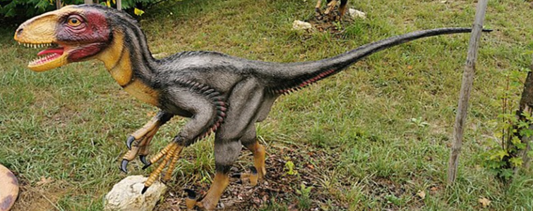

<h1 align="center">Deinonychus</h1>

> Fuente extraída desde este [enlace](https://www.mundoprimaria.com/dinosaurios/tipos-de-dinosaurios-y-nombres-especies/deinonychus)

## ¿Qué es un Deinonychus?

El Deinonychus fue un dinosaurio terópodo perteneciente al género de los droimeosaurios. Podría medir entre 2,7 a 3,40 metros de largo y su peso era de unos 75 kilogramos. Se caracterizaba por tener garras con forma de hoz en el segundo dedo de su pie.

Es posible que esta garra pudiera retraerse mientras el animal estaba en movimiento. Se piensa que también la usaba en movimiento. Se piensa que también la usaba para abrirla carne de sus presas. No obstante, estudios recientes y pruebas en base a los velociraptors indicas que Deinonychus en realidad apuñalo a sus presas, en lugar de cortarla.

También poseía tendones fuertes que les otorgaron equilibrio y una alta capacidad de giro en una carrera. De acuerdo a sus características es similar a un tipo de ave rapaz. Eran de tamaño mediano y caminaban sobre sus patas traseras.

## Hallazgo del Deinonychus

En 1931 en Montana el paleontólogo Barnum Brown encontró el esqueleto incompleto de un dinosaurio que medía unos 2,5 metros de longitud. Se trataba de un terópodo que formaba parte del grupo de los Allosaurus y de los Tyrannosaurus rex.

Tenía una estructura ágil, con huesos ligeros. También disponía de extensiones largas y fibrosas en las vértebras de la cola. Brown pensó que esto endurecía el apéndice en su conjunto, lo que le ayudaba a la cola a actuar como un excelente contrapeso para el resto de su anatomía.

Brown, quien pensó en escribir un manuscrito respecto a este descubrimiento no pudo hacer lo debido a su muerte en 1963. Antes de su partida logró mostrarle el esqueleto al joven investigador conocido como John Ostron.

Los conoció en 1963 durante la búsqueda de dinosaurios del Cretácico en Bridger, en Montana. Junto a una colega hallaron una mano con garras de un terópodo que sobresalía en la tierra,seguido de un pie. Esto dio lugar ala aparición de otra innumerable cantidad de huesos.

Con el tiempo Ostron notó que se trataba del mismo tipo de animal que Brown había encontrado décadas antes. Los llamó Deinonychus antirrhopyus en el año 1969. Esto lo hizo con la seguridad de haber recuperado los restos fósiles de cuatro individuos, en la misma cantera de Montana. Además todos se hallaron cerca de huesos de Tenontosaurus.

Cuando Ostron lo describió tuvo una gran revelación con respecto a las garras. Era evidente que el Deinonychus camina sosteniendo las garras en alto. Hasta entoncesse pensaba que los dinosaurios eran lentos y letárgicos. Pero este descubrimiento corrigió esa noción de las cosas Tenía huesos ligeros y garras siempre listas para pelear. Era evidente que se trataba de un animal muy activo.

Desde finales de los 60 y sobre todo durante la década del 70 se produjo el llamado _Renacimiento de los dinosaurios_. Fue una corriente nueva en la que se replanteó lo que se conocía sobreestos estos animales prehistóricos. Se esmpezó a considerar que las aves descienden de lso dinosaurios, algo que ganó consenso científico.

En cambio se cuestionaron viejas creencias sobre las tasas metabólicas de los dinosaurios.

## ¿Qué significa Deinonychus?

El nombre Deinonychus se originó en el griego _deinos_ que significa terrible y _nyus_ que quiere decir garra. De ahí que se lo interprete como _Garra Terrible_.

Por otro lado debido a su gran cola que parecía cumplir un papel compensador también se lo llamó _antirrhopus_ que viene del griego _antíporros_ que significa contrapeso.

## El grupo Dromaeosauridae

La familia de los dromaeosauridae es un clado de dinosaurios terópodos. Tienen algunas particularidades derivadas constituidas especialmente en modificaciones en la extremidad anterior que se materializó en un agarre flexible.

De hecho se cree que dicha transformación fue lo que dio lugar al _golpe de vuelo_ que tienen las aves. Actualmente se piensa que los pájaros tuvieron un ancestro en común con los dromeosauridae durante el Jurásico.

Es debido a esto que se los suele llamar como el _grupo hermano del clado de la aves_ Se supone que la ascendencia de las aves también estaría dromeosaurios, aunque no hay un acuerdo sobre esto aún.

### Los raptors

Los dromeosauridae eran los que se conoce como _rapaces_. Se trataba de un grupo de criaturas interesantes. El nombre de clado se refiere en realidad a lo que se conoce como _raptors_

Eran terópodos cuyo tamaño era entre pequeño, como del tamaño de un lobo, a grandes con una longitud de hasta 10 metros. Poseían una garra cortante bien desarrollada en su segunda falange pedal, una cola rígida que posiblemente funcionó como estabilizador dinámico y grandes manos para el agarre.

Ostentaban garras, mandíbulas musculosas, dentaduras fuertes y cuerpo ágiles. Fueron depredadores feroces y activos que tenían una capacidad versátil de movimiento.

Los dinosaurios que cuadran dentro de esta familia son el Deinonychus antirrhopus, el Velociraptor mongoliensis y el Utahraptor kirkland.

### La garra terrible

La garra asesina era una estructura infaltable en los Dromaeosauridae. Era muy útil para matar y en condiciones normales se mantenía alejada del suelo durante la locomoción, Sin embrago cuando los músculos del dedo del pie se contraían, esta garra bajaba rápidamente.

El ángulo de la base a la punta de la garra impulsó la transmisión de fuerzas entre la pata y la punta de la garra. Esto daba coo destripar rápidamente a un animal.

La cola rígida que poseían habría sido útil para la estabilización del cuerpo, en tanto que los brazos y mandíbulas sujetaban a la presa, Preservando su equilibrio. Se ha sugerido que los Dromeosauridae saltaban sobre presas grandes y usaban las cuatro extremidades para desgarrarlas. Los ornitomímidos habrían sido los más rápidos, aunque esto es una mera especulación.

Otras hipótesis indican que se comportaban como los leones y que manifestaban una conducta depredador similar, que prefería las emboscadas y las persecuciones rápidas. Emplearían su maniobrabilidad y sus tácticas de manada.

## Deinonychus Vs Velociraptor

A la hora de comprar al Deinonychus una de los adversarios más llamativos es el Velociraptor, un terópodo que poseía características similares. Un análisis de sus particularidades podría revelar quién hubiese sido el ganador en una pelea a muerte

### Diferencias

Las principales diferencias entre estos dinosaurios están relacionadas con el tamaño de cada uno y con su estilo de vida. Como dijimos antes el Deinonychus podría pesar al rededor de 75 kilos, llegando a veces a los 95. Y podría medir alrededor de 3 metros. SE piensa que cazaba sólo o en manadas.

El Velociraptor tenían un volumen que rondaba los 22 kilos y podía medir menos de un metro de altura. A pesar de lo que se cree cazaba solo e incluso se podía enfrentar a los suyos.

### Tamaño

El Deinonychus era más grande que el Velociraptor y poseía una mayor longitud. Si el primero podía medir 3,4 metros de largo el segundo apenas superaba el metro del largo, llegando en algunos casos a medir casi 2 metros.

### Velocidad y movimiento

El Velociraptor era más rápido que el Deinonychus. Podía correr entre 16 a 38 km/h. En cambio el Deinonychus poseía u cuerpo más grande ya que sus piernas estaban construidas para privilegiar la potencia por encima de la velocidad.

Se piensa que su caminata era de 9 km/h y que podría correr hasta 32 km/h en distancias cortas.

### Defensas

El Deinonychus tenía la capacidad de usar su tamaño y su postura amenazante para intimidar. Pero el Velociraptor era muy raudo y ágil lo que le servías para preservarse frente a innumerables depredadores.

### Capacidad ofensiva

En el ataque a sus presas el Deinonychus tenía la capacidad de saltar, atraparla con sus garras y devorarla son sus poderosos mordiscos. Tenía una mordida comparable a la de un caimán y con sus garras infringía un gran daño.

## Características del Deinonychus

## ¿Cuándo se extinguió el Deinonychus?
