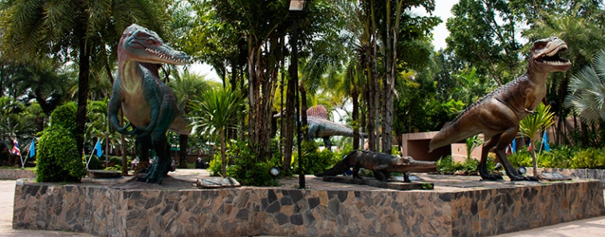
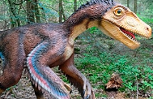
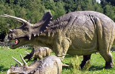
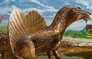

<h1 align="center">Tipos de dinosaurios y sus nombres por especies</h1>

> fuente extraída desde este [enlace](https://www.mundoprimaria.com/dinosaurios/tipos-de-dinosaurios-y-nombres-especies)

¿Te gustan los dinosaurios? ¡A nosotros también! De hecho, ¡nos encantan! Fueron criaturas increíbles que de tan sólo imaginarlas despiertan una mezcla de pavor y admiración. Por eso hemos reunido información sobre ellos.

Hubo una enorme variedad de dinosaurios que habitaron el planeta millones de años atrás. Algunos evolucionaron para convertirse en las aves que conocemos hoy. Pero la gran mayoría perecieron en la mortandad que dio fin al período Cretácico y que inició el Paleógeno, hace 66 millones de años.

A continuación, conocerás un poco más sobre esos especímenes que aún estimulan la imaginación y el asombro.

## Nombres de dinosaurios famosos en español

| Imagen                                                | Nombres        |
| ----------------------------------------------------- | -------------- |
|  | `Velociraptor` |
|    | `Triceratops`  |
|    | `Spinosaurus`  |
