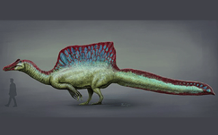
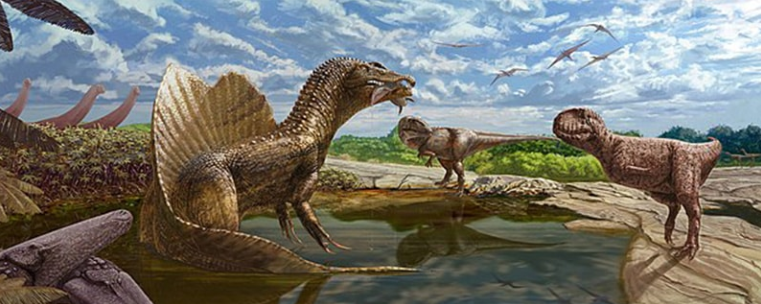
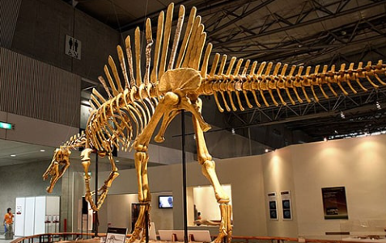
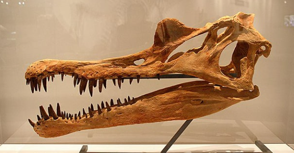
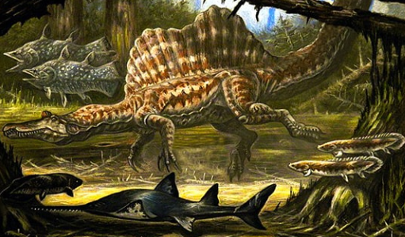

<h1 align="center">Spinosaurus</h1>

> fuente extraída desde este [enlace](https://www.mundoprimaria.com/dinosaurios/tipos-de-dinosaurios-y-nombres-especies/spinosaurus)

## ¿Qué es un Spinosaurus

El Spinosaurus fue el dinosaurio carnívoro terópodo más grande conocido. Se caracterizó por su solapa dorsal y su hocico estrecho. Fue el único depredador que vivió parcialmente en el agua, y que cazaba allí.

Se lo compara con frecuencia con el Tyrannosaurus rex aunque no vivieron en el mismo tiempo tenían características fascinantes que los convirtieron en increíbles depredadores de su época.

## ¿Dónde se descubrió el Spinosaurus?

El Spinosaurus es un género de dinosaurio del que solo se conoce hasta el día de hoy la especie _Spinosaurus aegyptiacus_. Su traducción es _lagarto espinoso egipcio_ y recibió su nombre de su ubicación en Egipto.

Ernst Stromer von Reinchenbach descubrió el primer ejemplar en 1912. También hubo otros hallazgos individuales que se atribuyen al _Spinosaurus maroccanus_. No obstante esta especie aún no ha sido reconocida debido a la falta de huesos que permitan estudiar sus sus características.

Desde entonces habido más hallazgos del carnívoro, encontrándose ejemplares que fueron más grandes que el Tyrannosaurus rex. Durante la Segunda Guerra Mundial estos hallazgos fueron destruidos en una noche,lo que lo convirtió en una leyenda inexplorada.

Aún hay descubrimiento aislados sobre el misterio dinosaurio. Sin embargo recién en 2014 se hizo público el descubrimiento de un esqueleto prácticamente completo con el cual se pudo obtener más información sobre este dinosaurio. Resultó ser una de las especies más intrigantes jamás encontradas.

Fue el único carnívoro de dos patas que vivía y cazaba en el agua, entre otros detalles. Se lo pude comparar con el cocodrilo o con un hipopótamo. No obstante pertenece a la familia de los terópodos, junto a los tiranosaurios o los alosaurios.

## ¿Cómo se clasifica el Spinosaurus?

El Spinosaurus pertenece a la clase Lizardaposaurus, más precisamente a la subclase de Terópodo. Estos fueron típicamente carnívoros bípedos, que también se pueden dividir en subgéneros adicionales.

En este caso formaba parte de los Spinosauridae que en su mayoría tenían un cráneo similar al de un cocodrilo y una vela dorsal.

Aunque vivían en parte en el agua, en dónde además nadaban y cazaban, no estaban relacionados con las otras especies acuáticas como los plesiosaurios o los masasaurios. Su afición por el agua es única entre los terópodos.

## ¿Cuándo vivió el Spinosaurus?

El Spinosaurus aegyptiacus vivió desde los 113 a los 94 millones de años a.c. en el período Cretácico. Concretamente existió en el Cretácico inferior y el superior, en los períodos Albiano (desde los 112,5 a los 100,5 millones de años a.c.) y el Cenomaniano (desde 100,5 a los 93,9 millones de años a.c.)

## ¿Cómo era el hábitat del Spinosaurus?

Los paleontólogos aún no se han puesto de acuerdo sobre el hábitat del Spinosaurus. No obstante, se supone que vivió en una región de marismas en lo que ahora es el norte de África. El primer esqueleto fue hallado en 1912, cerca del Oasis Bahariyya de Egipto. En lo que ahora es el norte de África. El primer esqueleto fue hallado en 1912, cerca del Oasis Bahariyya de Egipto.

El Spinosaurus existió allí junto con otros carnívoros de tamaño similar como el _Carcharondontosaurus_, que significa _lagarto de dientes afilados_. También cohabitó con herbívoros de cuellos largo como _Titanosaurio_, _Paralititan_ y _Aegyptosaurus_.

De la misma forma convivió en el mismo hábitat del cocodrilo Stomatosuchus de 10 metros de largo y con el Celacanto de 3,5m de largo. Sus fósiles se han encontrado en Marruecos, Níger, Túnez y Argelia. Su hábitat principal fue lo que hoy conocemos como África.

| Esqueleto de `Spinosaurus aegyptiacus` |
| -------------------------------------- |
|        |

## Esperanza de vida del Spinosaurus

Aún no hay un consejo sobre la esperanza de vida del Spinosaurus. Pero se estima que si un T-rex podía vivir un promedio de 30 años, se piensa que esta especie posiblemente haya vivido durante u lapso de tiempo similar, Haya debido a sus características comunes.

## características físicas y postura

La características particular del Spinosaurus es su vela dorsal. Estaba compuesto de una estructura espinosa alargada en la espalda que se conectaba a la piel. Eran extensiones de las vértebras dorsales, Que a menudo sobresalían como protuberancias en los dinosaurios.

Aún no se cuál era la función de esta vela. Se cree que sirvió para que se comunicaran con sus congéneres o como recurso para regular la temperatura corporal.

Su centro de gravedad se ubicaba más adelante que el del T-rex. Se supone que el Spinosaurus se movía sobre sus cuatro patas alternativamente, algo que usaba para remar y propulsarse en el agua.

De la misma forma es posible que tuviera dedos palmeados en las pata traseras. Como en todo terópodo, las patas traseras eran más poderosas que las delanteras. Su cola flexible le era útil para desplazarse a través de las corrientes acuáticas.

## Adaptaciones para la caza

El Spinosaurus poseía fosas nasales sobre el cráneo lo que les permitían respirar aun cuando sus cabezas se encontraban sumergidas. De manera similar a los cocodrilos los huesos en la punta del hocico poseían hoyuelos.

En los reptiles modernos estos pequeños órganos sensoriales registran la presión en el agua y entran en acción cuando una presa en el agua y entran en acción cuando una presa potencial se mueve. Los nervios transmiten la señal al cerebro,lo que ayuda a localizar presas en aguas turbias. Es posible que estos dinosaurios hubiesen tenido órganos sensoriales similares.

Los dientes inclinados en la parte delantera del hocico se engranaron con tanta fuerza que un pez resbaladizo no podía escapar. Las garras curvas en sus dedos tampoco permitían el escape de su comida.

Su pelvis era mucho más pequeña que la de otros dinosaurios depredadores, además de que sus muslos eran cortos y musculosos. Recuerdan a las aletas traseras de los lobos marinos que son útiles para remar vigorosamente en el agua.

No obstante podría haberles servido para ir en al tierra a buen ritmo para alcanzar la misma velocidad que puede desplegar un ser humano.

Los huesos de los grandes dinosaurios depredadores eran en su mayoría huecos para ahorrar peso. Pero en el Spinosaurus esto era todo lo contrario, ya que necesitaba que fuesen macizos para bucear con facilidad.

## Sobre sus espinas

Los largos dedos de los pies y las garras planas del dinosaurio son comparables a las aves acuáticas, que caminaban con seguridad sobre superficies con sus pies grandes, incluso en suelos fangosos. O tal vez servían como remos haciendo uso de dedos palmeados.

No obstante, los investigadores no pudieron encontrar evidencia de tales pieles en los fósiles antiguos.

Las vértebras de la coal del dinosaurio estaban apenas conectadas. Estos permitía que la misma se moviera de forma ondulaba, como la de los cocodrilos.

Por eso concluyeron que el Spinosaurus aegyptiacus ya estaba bien adaptado a la vida de un cazador acuático. Sus espinas de un metro de largo que sobresalían en sus vértebras no parecían encajar con sus características.

| Cráneo de `Spinosaurus`          |
| -------------------------------- |
|  |

| `Spinosaurus` cazaba en el agua  |
| -------------------------------- |
|  |
