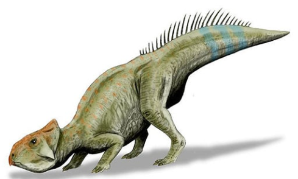
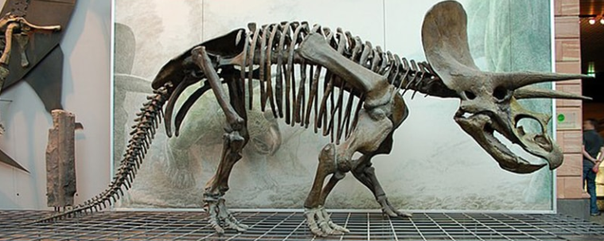
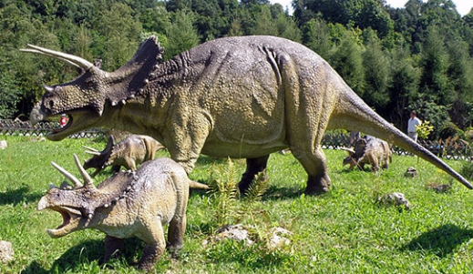
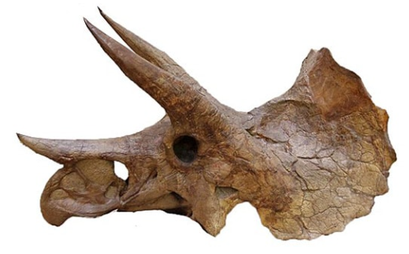

<h1 align="center">Triceratops</h1>

> fuente extraída desde este [enlace](https://www.mundoprimaria.com/dinosaurios/tipos-de-dinosaurios-y-nombres-especies/triceratops)

## ¿Qué es un Triceratops?

El Triceratops fue un dinosaurio herbívoro del período Cretácico. Se destacaba por su cabeza con tres cuernos y su escudo sobre su cabeza que se orienta hacia atrás y protegía su cuello.

Su nombre proviene de los términos griegos _tri_ que significa tres, y _keras_ o _keratops_ que quiere decir cuerno y _ops_ cuyo significado es _cara de tres cuernos_.

Se eligió este nombre debido a los tres cuernos prominentes que poseía, dos de los cuáles eran grandes y se ubicaban encima de los ojos. El más pequeños se ubicaba en el hocico.

## ¿Dónde vivió y dónde se descubrió esta especie?

El género de dinosaurio Triceratops fue descripto en 1889 por primera vez por el paleontólogo Othniel Charles Marsh. El espécimen pertenecía exactamente a la especie Triceratops horridus.

También se descubrió a un pariente el Triceratops torosaurus. Algunos especialistas piensan que era el masculino de la especie. Otros en cambio afirman que era sólo su forma adulta. Pero no se ha llegado a un acuerdo al respeto.

Desde entonces se han hallado más de 50 cráneos fósiles y partes del cuerpo de Triceratops mayormente en el norte De Estados Unidos. Más específicamente en los en los estados de Wyoming, montana, Colorado, Dakota del Norte y del Sur y en Canadá.

Estos restos han sido asignados a 16 especies diferentes de Triceratops.

## ¿Qué dinosaurios eran parientes del Triceratops?

Este ejemplar tenía muchos parientes o dinosaurios relacionados, con los cuáles poseía características en común. Diferentes géneros han evolucionado a lo largo de muchos años de evolución sobre la tierra que pertenecían a la familia Ceratopsidae.

Se destacan en número y tamaño en los cuernos, en las dimensiones del escudo en sus cuellos y en el tamaño general del cuerpo.

Un ejemplo de esto era el Leptoceratops que medía aproximadamente 2,7 metros de largo. No poseía cuernos y sólo un escudo de nuca muy pequeño . A esto se suma el Centrosaurus que poseía solo un cuerno grande en la nariz o el Einosaurus que ostentaba un cuerno nasal curvado hacia delante y otros do cuernos curvos que sobresalían en la parte superior de la nuca.

Por otro lado el Chasmosaurus tenía un escudo de cuello más grande que el Triceratops, acompañado de tres cuernos más pequeños. Finalmente el Zuniceratops llevaba solo dos cuernos sobre los ojos y ninguno en la nariz.

©️ Nobu Tamura - Creative Commons

## Clasificación del Triceratops

Las investigaciones paleontológicas han clasificado a los dinosaurios en dos clases. Por un lado están los lagartos saurios más conocidos como Saurisquios y los pájaros saurios llamados Ornisthischia.

Los primeros incluyen a herbívoros de cuatro patas y el cuello largo como el brachiosaurus y el diplodocus, pero también reúne a los carnívoros de dos patas como el Tyrannosaurus rex o el Velociraptor.

El Triceratops pertenece a la familia Ornisthischia. Incluye también a los Stegosaurus, Iguanodontes o Ankylosaurus. De la misma forma perteneces a los Ceratopsianos. Todos se caracterizaron por su su placa en la nuca, por su alimentación herbívora, por ser cuadrúpedos y la mayoría además poseía cuernos.

Las especies más conocidas son el Triceratops horridus y el Triceratops prorsus, ambos pertenecientes a los Ceratopsidae .

## ¿Cuándo vivió el Triceratops?

Estos dinosaurios vivieron durante la Era Mesozoica, que se divide en los períodos Triásico, Jurásico y Cretácico. En este caso habitaron durante el Cretácico Superior,hace 66 millones de años en el período Maastrichtiano.

Desaparecieron a causa de la Gran Extinción Masiva de Dinosaurios que ocurrió 66 millones de años. Fue una de las mortandades masivas de especies animales ocurridas en los último 550 millones de años en la Tierra, que tiene una existencia de 4600 millones de años.

## ¿Dónde vivieron los Triceratops?

Todos los hallazgos de los huesos de los Triceratops prueban que vivió en América del Norte. Durante el Cretácico el clima se equilibró entre lo cálido y lo húmedo. Solo hacia el final se enfrió y dejó que el nivel del mar descendiera, lo que provocó que partes grandes del territorio es unieran.

Debido a que no se han encontrado tumbas colectivas de Triceratops, no se sabe mucho sobre su comportamiento social. A juzgar por sus hallazgos individuales lo más probable es que fuera solitarios o que a lo sumo habitara en grupos pequeños.

## características físicas de los Triceratops

El Triceratops tenía un cráneo muy grande que poseía una forma ligeramente triangular considerando que tenía un hocico puntiagudo, pómulos prominentes y escudo en la nuca. Disponía de fosas nasales y redondas, y de un pequeño cuerno redondeado en la nariz.

Es probable que estos rasgos le permitieran defenderse de depredadores como el Tyrannosaurus rex. Además podía atacar con sus cuernos y usar su escudo para proteger su cuello de las mordidas de este contrincante.

Se estima también que los cuernos y escudos les permitían comunicarse con sus congéneres.

Su tricornio era robusto y sus extremidades eran fuertes, con las patas delanteras más cortas que que las traseras en la mayoría de los casos. Sus patas delanteras poseía cinco dedos y las patas traseras, cuatro.

## Peso, tamaños y velocidad

El triceratops podía medir hasta 9 metros de largo y su volumen corporal oscilaba entre las 5 & 10 toneladas. Su altura era de 3 metros y los cuernos sobre su sus ojos podían medir más de 1 metros de largo.

