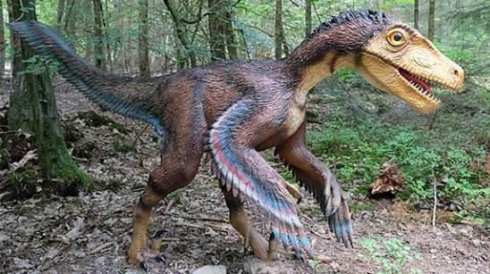
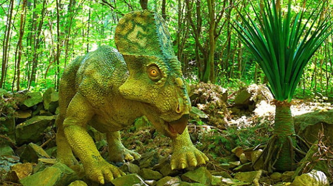
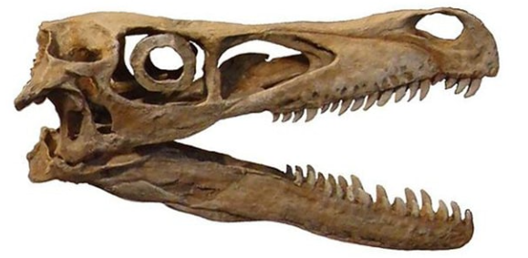
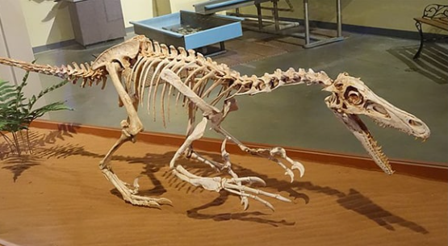
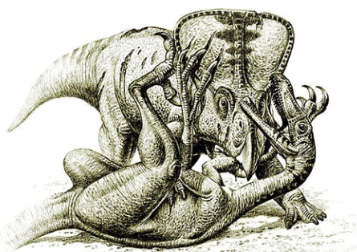

<h1 align="center">Velociraptor</h1>

> fuente extraída desde este [enlace](https://www.mundoprimaria.com/dinosaurios/tipos-de-dinosaurios-y-nombres-especies/velociraptor)
> El velociraptor fue un dinosaurio dromeosárido que vivió hace 75 millones de años,durante el período Cretácico. Era bípedo y se estima que tenía un cuerpo emplumado muy simimar al de las aves modernas.

Los arqueólogos ha descubierto dos especies que que son el Velociraptor Mongoliensis y el Velociraptor OsmoIskae. Fue descubierto por primera vez durante una excursión del Museo Americano de Historia Natural en el desierto Gobi en Mongolia.

El 11 de agosto de 1923, Peter Kaisen encontró el primer fósil registrado del Velociraptor. Sin embargo fue declarado como un nuevo espécimen en 1924 por Henry Fairfield Osborn que era el presidente de la institución. Fue este el que lo llamó Velociraptor combinando los términos en latín velox (veloz) y raptor (ladrón).

Poseía una larga cola y una garra retráctil en forma de hoz en cada una de sus patas. Los científicos y arqueólogos piensan que con estos destripaba a sus presas, dado que sin dudas era carnívoro.

Esta garra era muy eficiente tanto como para desgarrar como para retener a su comida. También tenía dos garras adicionales en cada pata que eran bastante similares a los huesos de las aves modernas.

El velociraptor era bastante pequeño en la vida real. Tenía en realidad el tamaño de un pavo moderno. Los fósiles que se hallaron del velociraptor medían hasta 2 metros de largo y unos 50 centímetros de alto.

©️ Chrisi1964 - Creative Commons

## Hallazgos sobre el velociraptor

En 1971 se descubrió un espécimen de velociraptor que proporcionó evidencia física directa de los rasgos depredadores del animal Estudiaron su postura y reparación para el combate junto con un ejemplarde proteceratops.

De esta dedujeron que era un animal carroñero, pero que también cazaba activamente animales de tamaños similares al suyo o más pequeños. La garra de hoz del velociraptor parece haber sido su arma más potente y probablemente fue utilizada para destripar o perforar órganos vitales en el abdomen y la garganta.

Los científicos no está seguros de si el velociraptor cazabas solo o en manadas. Tampoco está claro si prefería cazar de día o de noche. No obstante todo parece indicar que pudo haber sido más bien un animal nocturno.

## ¿Qué comía el velociraptor?

Observando los dientes los paleontólogos que estudiaron sus fósiles están seguros de que era un animal carnívoro. Eran largos, afilados y poseían bordes dentados como un cuchillo.

Los animales modernos como los leones poseen dientes similares, por lo que los científicos tienen la seguridad de de que comía carne. Aunque esta también incluía la carroña o animales como el Protoceratops.

©️ DinoTeam - Creative Commons

## ¿Cómo se clasifica el velociraptor?

Este dinosaurio pertenece al grupo Dromaesauridae que reunía a los lagartos corredores. Se trata de los terópodos, dinosaurio que caminaban sobre su dos patas traseras y que eran carnívoros.

De la misma forma también integran el grupo Coelurosaurioa que incluye al Tyrannosaurus rex que estaban relacionados estrechamente con las aves. Se han hallado muchos fósiles de este tipo que es muy posible que poseyeran plumas.

El grupo de aves rapaces incluyen por ejemplo, los dos géneros de Utahraptor y Austroraptor que eran grandes y los especímenes Microraptor y Dromaesaurus que eran pequeños. Las especies que se conocen son el Velociraptor Mongoliensis y el Velociraptor OsmoIskae.

## ¿Cuándo vivió el velociraptor?

Este dinosaurio vivió entre los 85 a los 67 millones de años a.C., dentro del Cretácico Superior. El Cretácico es el período más joven de la era mesozoica, compuesta por los los períodos Triásico, Jurásico y Cretácico.

La época exacta en la que se han descubierto sus fósiles abarca desde el Santoniense superior hace 83,6 millones de años, pasando por el Campaniano, hasta Maastrichtiano hace 72 millones de años.

## ¿Cómo era el hábitat del velociraptor?

De acuerdo a las excavaciones del Velociraptor habitaba en un terreno seco y arenoso, propio de un desierto, Sus esqueletos se han encontrado en lo que hoy es Mongolia y el norte de china. El clima de entonces era tropical, y abundaban las tormentas de arena.

Vivió con otras especies contemporáneas como los ceratopsianos que incluyen al Proteceratops y al Udanoceratops, anquilosáurios como el como el pinacosaurus y otros terópodos como el Oviraptorids o el Troodontids.

## Características físicas del Velociraptor

En comparación con el tamaño de su cuerpo, el velociraptor poseía un cerebro bastante grande. Debido a esto no es exagerado suponer que era un poco inteligente que otros dinosaurios.

Poseía un hocico plano que estaba ligeramente orientado hacia arriba y al frente y al frente y su mandíbula ostentaba alrededor de 28 dientes a cada lado.

Las piezas dentarias eran más afiladas en el borde cortante trasero que en el delantero, lo que supone que se había adaptado a perseguir presas rápidas. Sus garras y su agilidad también era características muy importantes. Cada mano, que poseía tres garras es comparable a las patas flexibles que tienen las aves al día de hoy.

La garra en forma de hoz que sobresalía y que y que estaba agrandaba en el segundo de sus tres dedos le permitía cazar y escalar. EL primer dedo del pie estaba severamente hundido y el tercero estaba más en contacto con el suelo que pisaba el animal.

Sus ojos estaba bien orientados hacia adelante lo que le confería una gran orientación en el espacio. Tal como sucedía con los otros terópodos tenía la espalda y la cabeza ubicamos paralelamente al suelo. Podía rotar su cabeza con amplitud, lo que también contribuía con su amplio campo de visión.

©️ Eduard Solà Vázquez - Creative Commons

## Plumaje

Las investigaciones han encontrado que este grupo poseía un plumaje y alas desarrolladas. También tenía articulaciones ágiles en los brazos. No podía volar, pero sus eran útiles para la regulación de su temperatura, en el apareamiento, en la incubación de sus huevos y en el desarrollo de cierta aerodinámica que le permitía ser veloz.

Los restos fósiles indicaron su presencia debido a que abundaba en nudos de púas a lo largo de sus antebrazos. Parece haber tenido tenido catorce plumas secundarias en sus alas.

La presencia de las plumas ha demostrado ser extremadamente fructífera para los científicos y arqueólogos modernos en sus investigaciones . Esto les ha permitido ver las similitudes con las aves modernas.

También se creía que las tenían los Tiranosaurios rex debido a que sus fósiles también poseían marcas similares a púas. Aunque esto todavía debe confirmarse con una investigación adicional.

## peso y tamaño

Los huesos encontrados de Velociraptor eran huecos y similares a los de aves que conocemos en la actualidad. Se estima que no pesaron más de 15 kg, por lo que su tamaño no era mayor al de un pavo o un perro. Su cráneo medí unos 25 centímetros de alto y su garra en forma hoz alcanzaba los 6,5 centímetros.

©️ Jens Lallensack - Creative Commons

## Esperanza de vida

Aún no se ha podido establecer que tanto podía vivir un velociraptor. Debido a que era más pequeño que un Tiranosaurio rex se estima que podría haber vivido un lapso de 30 años.

## comportamiento de caza y velocidad

Los hallazgos obtenidos parecen indicar cazaban solos por lo general. No obstantes es posible que algunas congéneres hayan unido sus fuerzas para la caza. También se piensa que prefería servirse de las presas de otros predadores en un total comportamiento carroñero.

Sus grandes garras y su velociraptor que oscilaba entre los 40 y 60 km/h lo ayudaron a robar rápidamente piezas individuales y escapar. Si no podía encontrar presas para hurtar, probablemente cazaba mamíferos y reptiles pequeños.

Con su garra prominente podía trepar o atrapar sus presas. Por otro lado , sus manos y dientes servían para comer y causar heridas a sus contrincantes.

Un fósil del velociraptor fue hallado luchando contra un Protoceratops, lo que da cuenta de que se involucró en batallas con saurios más grandes. Se piensa que estos animales fueron enterrados vivos por una avalancha de arena o una tormenta.

©️ Raul Martin - Creative Commons

## ¿Cuándo se extinguió el velociraptor

Este planeta ya tiene 4600 millones de años y la extinción masiva de los dinosaurios fue una de cinco en lo últimos 500 millones de años. Las primeras especies de dinosaurios aparecieron hace 245 millones de años.

Es posible que el velociraptor apareciera hace millones de años y que viviera durante 18 millones de años. Algunos investigadores estiman que desapareció hace 76 millones de años., posiblemente debido a variaciones en el clima. Para otros su extinción coincidió con la mortandad masiva de hace 66 millones de años.

Investigaciones realizadas en el 2020 revelan que definitivamente vivió hace 67 millones de años. Se hallaron 20 fragmentos de huesos en Nuevo México. Lo que revela que no vivieron sólo en Asia. El dinosaurio en forma de pájaro es además una de las últimas especies de dinosaurios antes de la gran extinción.
